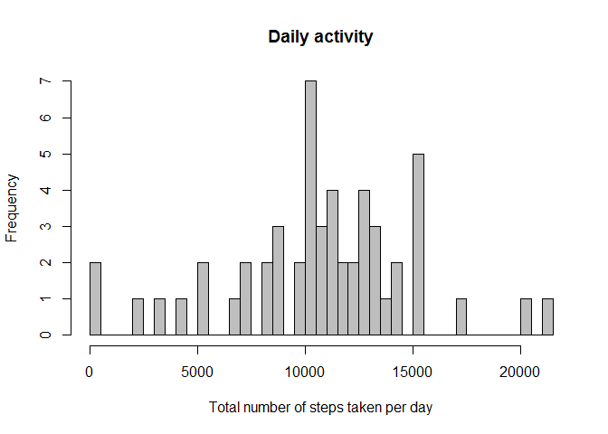
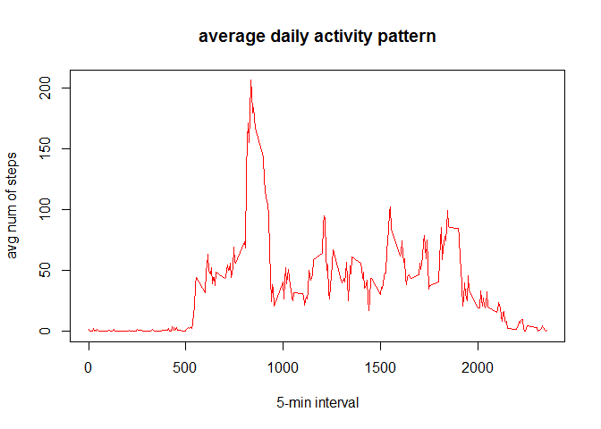
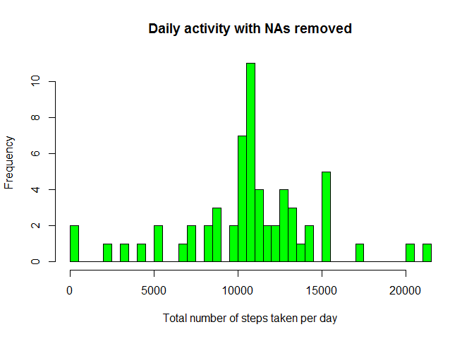
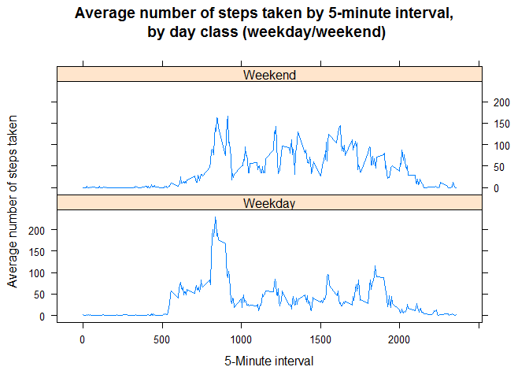

# Reproducible Research: Peer Assessment 1


## Loading and preprocessing the data

```r
activ <- read.csv("activity.csv",header = TRUE, sep = ",")
head(activ)
```

```
##   steps       date interval
## 1    NA 2012-10-01        0
## 2    NA 2012-10-01        5
## 3    NA 2012-10-01       10
## 4    NA 2012-10-01       15
## 5    NA 2012-10-01       20
## 6    NA 2012-10-01       25
```

removing missing values...


```r
activ <- activ[complete.cases(activ),]
head(activ)
```

```
##     steps       date interval
## 289     0 2012-10-02        0
## 290     0 2012-10-02        5
## 291     0 2012-10-02       10
## 292     0 2012-10-02       15
## 293     0 2012-10-02       20
## 294     0 2012-10-02       25
```


## What is mean total number of steps taken per day?

1. Calculate the total number of steps taken per day


```r
dailyActiv <- data.frame(aggregate(activ$steps, by=list(activ$date), FUN=sum))
colnames(dailyActiv)<- c("date","totalSteps")
```

### Make a histogram of the total number of steps taken each day


```r
hist(
        dailyActiv$totalSteps,
        col = "grey",
        main = "Daily activity",
        xlab = "Total number of steps taken per day",
        breaks = 53 # number of days
)
```

<!-- -->

### Calculate and report the mean and median of the total number of steps taken per day

Mean:


```r
mean(dailyActiv$totalSteps)
```

```
## [1] 10766.19
```

Median:


```r
median(dailyActiv$totalSteps)
```

```
## [1] 10765
```

## What is the average daily activity pattern?

### Make a time series plot (i.e. type = "l") of the 5-minute interval (x-axis) and the average number of steps taken, averaged across all days (y-axis)


```r
intervalActiv <- data.frame(aggregate(activ$steps, by=list(activ$interval), FUN=mean))
colnames(intervalActiv)<- c("interval","meanSteps")
#explore dataset
head(intervalActiv)
```

```
##   interval meanSteps
## 1        0 1.7169811
## 2        5 0.3396226
## 3       10 0.1320755
## 4       15 0.1509434
## 5       20 0.0754717
## 6       25 2.0943396
```

```r
plot(intervalActiv$interval,intervalActiv$meanSteps, col="red", type="l", 
         xlab="5-min interval", ylab="avg num of steps", main="average daily activity pattern")
```

<!-- -->

### Which 5-minute interval, on average across all the days in the dataset, contains the maximum number of steps?


```r
intervalActiv[intervalActiv$meanSteps == max(intervalActiv[2]), ]
```

```
##     interval meanSteps
## 104      835  206.1698
```


## Imputing missing values

### Calculate and report the total number of missing values in the dataset (i.e. the total number of rows with NAs)


```r
activ <- read.csv("activity.csv",header = TRUE, sep = ",")
activNull <- activ[is.na(activ$steps),]
numActivNull <- nrow(activNull)
```

the total number of rows with NAs is 2304

### Devise a strategy for filling in all of the missing values in the dataset. The strategy does not need to be sophisticated. For example, you could use the mean/median for that day, or the mean for that 5-minute interval, etc. Create a new dataset that is equal to the original dataset but with the missing data filled in.


```r
fillActiv <- merge(activ, intervalActiv, by = 'interval', all.y = F)
fillActiv$steps[is.na(fillActiv$steps)] <- round(fillActiv$meanSteps[is.na(fillActiv$steps)])
# reorder columns to get a dataframe equal to the original dataset
fillActiv <- fillActiv[c(2,3,1)]
head(fillActiv)
```

```
##   steps       date interval
## 1     2 2012-10-01        0
## 2     0 2012-11-23        0
## 3     0 2012-10-28        0
## 4     0 2012-11-06        0
## 5     0 2012-11-24        0
## 6     0 2012-11-15        0
```

### Make a histogram of the total number of steps taken each day and Calculate and report the mean and median total number of steps taken per day. Do these values differ from the estimates from the first part of the assignment? What is the impact of imputing missing data on the estimates of the total daily number of steps?


```r
dailyActiv2 <- data.frame(aggregate(fillActiv$steps, by=list(fillActiv$date), FUN=sum))
colnames(dailyActiv2)<- c("date","totalSteps")


hist(
        dailyActiv2$totalSteps,
        col = "green",
        main = "Daily activity with NAs removed",
        xlab = "Total number of steps taken per day",
        breaks = 53 # number of days
)
```

<!-- -->

### Calculate and report the mean and median of the total number of steps taken per day

Mean:


```r
mean(dailyActiv2$totalSteps)
```

```
## [1] 10765.64
```

Median:


```r
median(dailyActiv2$totalSteps)
```

```
## [1] 10762
```

mean of daily activity is 1.0766189\times 10^{4} while mean of daily activity with NAs removed is 1.0765639\times 10^{4}. The values are close since complete cases function was applied in the first run and NAs values were replaced with mean values in the second run. 

Median of daily activity is 10765 while mean of daily activity with NAs removed is 1.0762\times 10^{4}. The values are close since complete cases function was applied in the first run and NAs values were replaced with mean values in the second run.


## Are there differences in activity patterns between weekdays and weekends?
### Create a new factor variable in the dataset with two levels - "weekday" and "weekend" indicating whether a given date is a weekday or weekend day.


```r
fillActiv$date <- as.Date(fillActiv$date)
fillActiv$dayClass <- as.factor(ifelse(weekdays( fillActiv$date) %in% c("sábado","domingo"), "Weekend", "Weekday")) 
head(fillActiv)
```

```
##   steps       date interval dayClass
## 1     2 2012-10-01        0  Weekday
## 2     0 2012-11-23        0  Weekday
## 3     0 2012-10-28        0  Weekend
## 4     0 2012-11-06        0  Weekday
## 5     0 2012-11-24        0  Weekend
## 6     0 2012-11-15        0  Weekday
```

### Make a panel plot containing a time series plot (i.e. type = "l") of the 5-minute interval (x-axis) and the average number of steps taken, averaged across all weekday days or weekend days (y-axis). See the README file in the GitHub repository to see an example of what this plot should look like using simulated data.


```r
intervalActivDayClass <- data.frame(aggregate(fillActiv$steps, by=list(fillActiv$interval,fillActiv$dayClass), FUN=mean))
names(intervalActivDayClass) <- c("interval","dayClass","meanSteps")

# explore dataframe
head(intervalActivDayClass)
```

```
##   interval dayClass  meanSteps
## 1        0  Weekday 2.28888889
## 2        5  Weekday 0.40000000
## 3       10  Weekday 0.15555556
## 4       15  Weekday 0.17777778
## 5       20  Weekday 0.08888889
## 6       25  Weekday 1.57777778
```


```r
## plot time series
library(lattice)
xyplot(
        meanSteps ~ interval | dayClass,
        intervalActivDayClass,
        type = "l",
        layout = c(1,2),
        main = "Average number of steps taken by 5-minute interval,\n by day class (weekday/weekend)",
        xlab = "5-Minute interval",
        ylab = "Average number of steps taken"
)
```

<!-- -->


